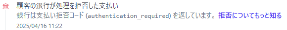

# Stripe 決済検証ページ

発注時にクレジットカードを保存し、後で管理者が決済を行うフローを検証します。

## フロー

1. サーバーサイド
   1. Customer を作成
   2. Setup Intent を作成
2. フロント
   1. Client Secret を使って UI を PaymentElement を表示
   2. confirmSetup を実行
3. リダイレクト
4. フロント
   1. リダイレクトパラメーターから Setup Intent を取得
   2. テスト決済を実行
5. サーバーサイド
   1. Setup Intent の Payment Method を使用して Payment Intent を登録して決済の実行 (実際は管理者が行う事を想定)

参考

- https://docs.stripe.com/payments/payment-intents
- https://docs.stripe.com/payments/setup-intents

## 現在の課題

3DS のテストカード番号のうち、正常に取引出来てほしい1つのカード番号で認証エラーになる。

https://docs.stripe.com/testing?locale=ja-JP#regulatory-cards

4000002500003155 : 設定がない場合に認証 - OK  
4000002760003184 : 常に認証 - NG  
4000003800000446 : すでに設定 - OK  
4000008260003178 : 残高不足 - NG (残高不足なので NG で正しい)  

なお、この際のエラーは `authentication_required` となっており、ダッシュボード上は銀行による拒否となっている。

